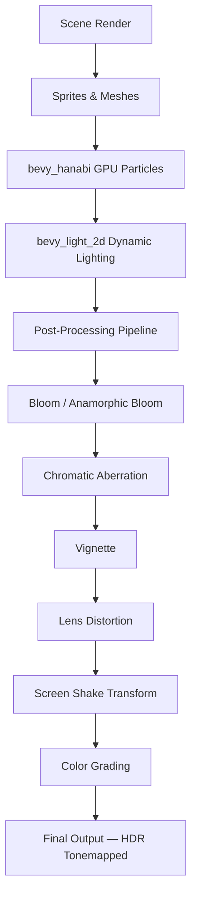
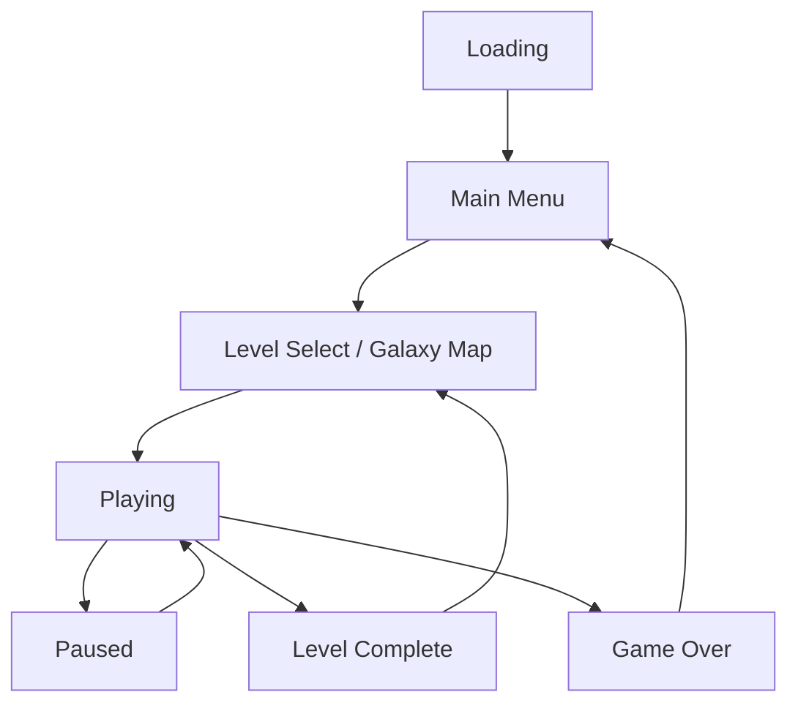
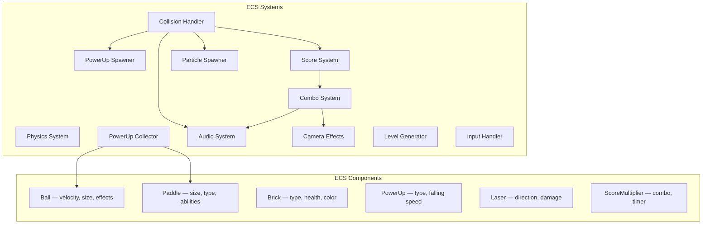
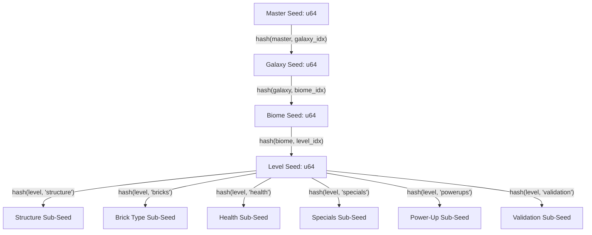
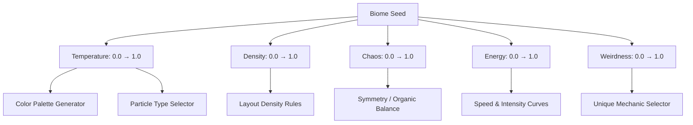
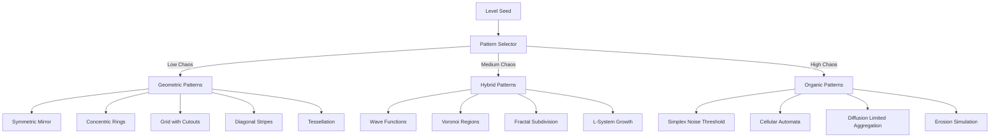
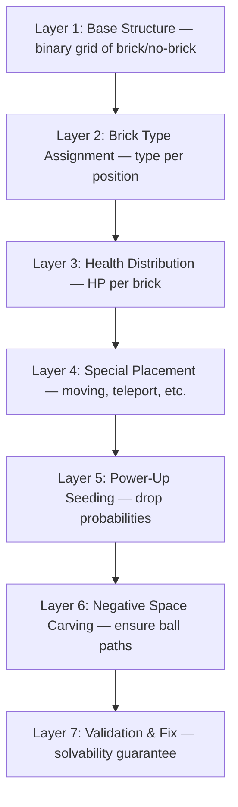
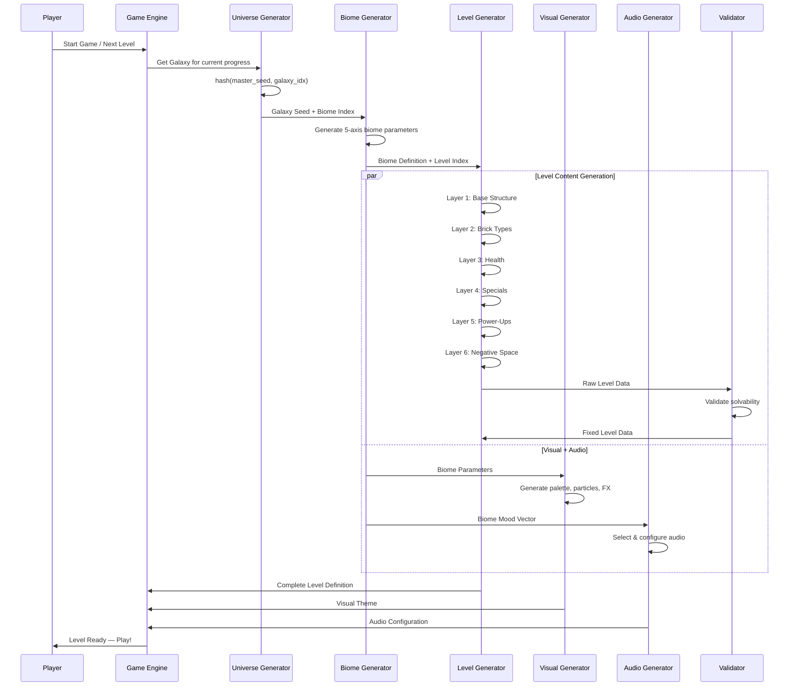
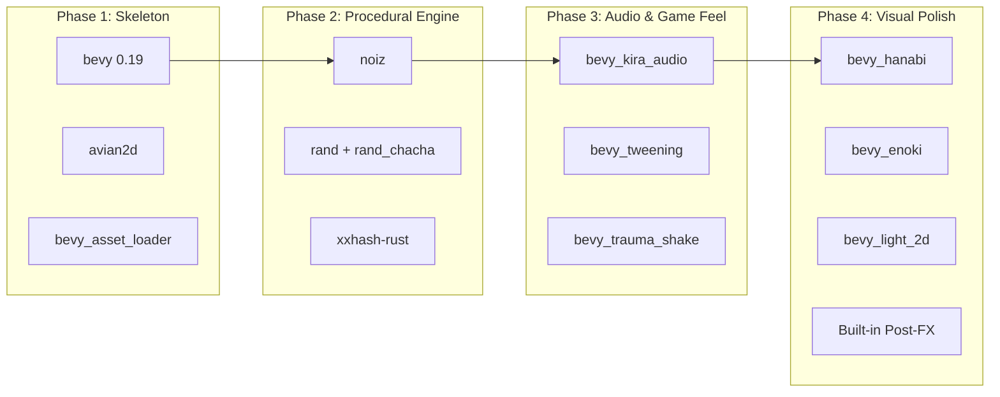

# Metanoid — Complete Project Plan

## 1. Project Overview

Metanoid is an advanced Breakout/Arkanoid game built in pure Rust using Bevy 0.19. It features GPU-driven visual effects, ECS-native physics, an infinite procedural level generation engine inspired by No Man's Sky, and a rich power-up system inspired by DX-Ball 2. The game targets desktop (Vulkan/Metal/DX12) and browser (WebGPU/WASM).

---

## 2. Technology Stack

### 2.1 Engine: Bevy 0.19 (June 2026)

Bevy was chosen for its ECS architecture (modular behavior composition — attach a `Fireball` component and all fire-related systems pick it up automatically), GPU-driven rendering (3x performance boost in scenes with hundreds of bricks and particles), massive plugin ecosystem, and WASM support for browser distribution.

Bevy 0.19 provides the following features **built-in**, eliminating the need for external crates: BSN declarative scene system (`bsn!` macro for procedural scene construction), post-processing (Bloom, Anamorphic Bloom, Chromatic Aberration, Vignette, Lens Distortion, Gaussian Blur, Depth of Field, Motion Blur, Auto Exposure), Feathers UI widgets (text input, dropdowns, list views, scrollbars — covers menus, settings, HUD, leaderboards), App Settings persistence (cross-platform save/load for volume, graphics, keybindings, highscores via `SettingsPlugin::new("com.yourname.metanoid")`), 2D shape rendering (mesh primitives replace `bevy_prototype_lyon`), EditableText, and automatic Render Recovery from GPU crashes.

### 2.2 Rendering Pipeline

The GPU backend is wgpu (built-in), which abstracts over Vulkan (Windows/Linux), Metal (macOS/iOS), DX12 (Windows), and WebGPU (Browser). The rendering pipeline flows as: Scene Render → Sprites & Meshes → GPU Particles (bevy_hanabi) → 2D Lighting (bevy_light_2d) → Post-Processing (Bloom → Chromatic Aberration → Vignette → Lens Distortion → Screen Shake Transform → Color Grading) → Final Output (HDR Tonemapped).



### 2.3 CPU vs GPU Division

The CPU handles game logic, physics (Avian2D), input, power-up logic, score/state management, and procedural generation. All of this runs multi-threaded automatically via Bevy's ECS scheduler (independent systems execute in parallel). The GPU handles particle simulation (bevy_hanabi compute shaders — millions of particles at zero CPU cost), dynamic 2D lighting and shadows, bloom/post-processing, sprite rendering, and custom shader effects.

---

## 3. External Dependencies (11 crates)

### 3.1 Core Game Mechanics

**avian2d 0.7** — ECS-native 2D physics engine built specifically for Bevy. All physics data (rigid bodies, colliders, joints) are regular Bevy components queryable in systems. Provides Continuous Collision Detection (critical for fast balls passing through bricks), collision layers (ball-brick, ball-paddle, power-up-paddle), spatial queries (raycasting, shapecasting), collision events and hooks, and debug rendering. Usage: `RigidBody::Dynamic` for balls, `RigidBody::Kinematic` for paddle (player-controlled), `RigidBody::Static` for walls, `Collider::rectangle()` for bricks/paddle, `Collider::circle()` for ball. Collision hooks allow custom behavior like fireball passing through bricks without stopping.

**bevy_kira_audio 0.25** — Advanced game audio engine wrapping Kira. Provides multiple audio channels (music, SFX, UI), tweens on volume/pitch/panning over time, spatial audio (ball hits left side → sound from left), streaming for background music, and playback rate control for dynamic pitch shifting. Usage: different sounds per brick type (metal, glass, wood, explosion), pitch rising with combo counter, background music intensifying with gameplay intensity, whoosh for fast balls, unique power-up pickup sounds.

**bevy_asset_loader 0.26** — Manages asset loading with game states. Provides derive macros for asset collections, ensures everything is loaded before state transitions, and enables loading screens with progress bars. Manages the Loading → Menu → InGame → Paused state flow.

### 3.2 Game Juice & VFX

**bevy_hanabi 0.19** (with `default-features = false, features = ["2d"]`) — GPU particle system using compute shaders. Simulates millions of particles with zero CPU cost. Expression API supports: constant-rate and burst spawning, initial position on shapes (circle, sphere, cone), forces (gravity, radial acceleration, tangent acceleration, force fields, linear drag), color/size gradients over particle lifetime, stretch along velocity, trails/ribbons, and HDR + Bloom support. Usage: brick break bursts (particles in brick color), ball trail, fireball flames, explosive brick detonations, power-up glow auras, atmospheric background particles.

**bevy_enoki 0.7** — CPU-based 2D particle system with SIMD + GPU instancing. Complements bevy_hanabi by supporting custom fragment shaders per effect, `.ron` configuration with hot reload, and runs on WebGL2 (broader compatibility). Includes a visual editor (`cargo install enoki2d_editor`). Usage: dissolve effects, chromatic particle trails, shield distortion — effects requiring unique shaders rather than raw particle count.

**bevy_light_2d 0.9** — Dynamic 2D lighting with shadows. Provides point lights, light occlusion, dynamic shadows, and per-camera ambient light. Usage: balls emit colored light, explosive bricks pulse red light, power-ups glow, paddle has a light halo, dark biomes use the ball as the only light source (lighting becomes a mechanic). *Note: verify 0.19 compatibility before adding — last confirmed version is 0.9 for Bevy 0.18.*

**bevy_tweening 0.16** — Tween animations with 30+ easing functions (ease-in-out, bounce, elastic, back, cubic bezier). Animates any ECS property: transform, color, scale, opacity. Usage: bricks entering the scene (scale 0→1 with bounce), smooth paddle resize, power-up floating oscillation, hit flash effect (color tween), HUD score fly-up, menu transitions.

**bevy_trauma_shake 0.7** — Trauma-based camera shake. Adds a trauma value (0.0–1.0) that decays over time and translates to random camera translation/rotation. Three lines of code: add component to camera, send trauma event on impact. Usage: brick break → trauma 0.1, explosion → trauma 0.5, combo x20 → trauma 0.3.

### 3.3 Procedural Engine

**noiz 0.5** — Noise generation library built specifically for Bevy. Uses `bevy_math`, is Reflectable and Serializable (important for saving procedural parameters), is `no_std` compatible, and has a clean modern API. Provides Simplex, Perlin, Worley/Voronoi (including distance-to-edge for biome boundaries), Value noise, cell noise, octave layering (fbm), noise derivatives, and custom hash-based RNG (no permutation table — fewer tiling artifacts). Usage: Simplex/Perlin for level base structure (threshold noise → brick/no-brick decisions), Worley for biome regions and brick type clusters, octave layering for complexity, derivatives for edge detection between regions.

**rand 0.9 + rand_chacha 0.9** — Deterministic cross-platform PRNG. `ChaCha8Rng` produces identical results on x86, ARM, and WASM — critical for shareable seeds. Usage: structural pattern selection, power-up drop probabilities, brick type assignment, special placement, all "random" decisions in the procedural engine.

**xxhash-rust 0.8** (with `features = ["xxh3"]`) — The fastest non-cryptographic hash function available. Excellent avalanche property (one bit change → completely different output). Usage: seed hierarchy generation — `hash(master_seed, galaxy_index)` → Galaxy Seed, `hash(galaxy_seed, biome_index)` → Biome Seed, `hash(level_seed, "structure")` → Structure Sub-Seed. Each layer gets a separate sub-seed so that algorithm changes to one layer don't break others.

### 3.4 Serialization

**serde 1** (with `derive` feature) and **serde_json 1** — Standard serialization for game state, level definitions, and configuration files.

---

## 4. Cargo.toml

```toml
[package]
name = "metanoid"
version = "0.1.0"
edition = "2024"

[dependencies]
# Core Engine
bevy = { version = "0.19", features = ["wayland"] }

# Core Game Mechanics
avian2d = "0.7"
bevy_kira_audio = "0.25"
bevy_asset_loader = "0.26"

# Game Juice & VFX
bevy_hanabi = { version = "0.19", default-features = false, features = ["2d"] }
bevy_enoki = "0.7"
bevy_light_2d = "0.9"
bevy_tweening = "0.16"
bevy_trauma_shake = "0.7"

# Procedural Engine
noiz = "0.5"
rand = "0.9"
rand_chacha = "0.9"
xxhash-rust = { version = "0.8", features = ["xxh3"] }

# Serialization
serde = { version = "1", features = ["derive"] }
serde_json = "1"

[profile.release]
opt-level = 3
lto = "fat"
codegen-units = 1
strip = true

[profile.dev]
opt-level = 1

[profile.dev.package."*"]
opt-level = 3
```

**Note:** Crate versions may shift — always check compatibility tables in each crate's README when running `cargo add`. The version pairings listed here are based on the Bevy 0.19 ecosystem as of July 2026.

---

## 5. Game Architecture

### 5.1 Game States



### 5.2 ECS Design

**Core Components:** Ball (velocity, size, active effects list), Paddle (size, type, abilities), Brick (type, health, color, contained power-up), PowerUp (type, falling speed), Laser (direction, damage), Particle (GPU-managed via bevy_hanabi), ScoreMultiplier (combo count, combo timer).

**Core Systems:** Physics System (Avian2D integration), Collision Handler (dispatches events to other systems), PowerUp Spawner (creates falling power-ups from destroyed bricks), PowerUp Collector (applies power-up effects when collected by paddle), Score System (calculates points with multipliers), Combo System (tracks consecutive hits, adjusts audio pitch, visual intensity), Particle Spawner (triggers bevy_hanabi effects on events), Audio System (plays sounds with spatial positioning and combo-based pitch), Camera Effects (bloom intensity, chromatic aberration, screen shake), Level Generator (procedural engine — produces complete level definitions), Input Handler (paddle movement, pause, bullet time activation).



---

## 6. Power-Up System

Inspired by DX-Ball 2 with modern additions. Power-ups drop from destroyed bricks and fall toward the paddle. The player catches them to activate. Some are positive, some negative, creating risk/reward dynamics.

### 6.1 Ball Modifiers

Fireball (explosion on impact, destroys neighbors), Brick-Thru (passes through bricks without bouncing), Mega Ball (oversized ball, more destruction), Shrink Ball (tiny ball, +50% score), Split Ball (splits into 2), Eight Balls (spawns 8 balls), Gravity Ball (gravity affects ball trajectory), Fast Ball (speed increase), Slow Ball (speed decrease), Magnet Ball (attracted toward nearby bricks — new), Phantom Ball (phases in and out of visibility — new).

### 6.2 Paddle Modifiers

Laser Paddle (fires projectiles), Grab Paddle (catches ball, player aims and releases), Expand Paddle (wider), Shrink Paddle (narrower — negative), Shield (barrier at bottom of screen — new), Mirror Paddle (two paddles, top and bottom — new).

### 6.3 Board Modifiers

Falling Bricks (bricks descend), Zap Bricks (removes invincible status), Explode (detonates all explosive bricks), Expand Exploding (explosive bricks grow their blast radius), Lightning (random lightning strikes destroy bricks), Shockwave (radial blast from impact point — new), Shuffle Bricks (randomizes remaining brick positions — new).

### 6.4 General

Extra Life, Level Warp (skip to next level), Double Points, Kill Paddle (instant life loss — negative), Time Slow / Bullet Time (everything slows except paddle — new), Random Power (activates a random power-up — new).

---

## 7. Brick Types

**Normal** — destroyed in one hit, solid color with subtle glow. **Multi-Hit (2–4 HP)** — requires multiple hits, shows progressive cracks and color shifts per hit. **Invincible** — cannot be destroyed, shiny metallic appearance with idle particles. **Almost-Invincible** — destroyed only by special effects (fireball, laser, explosion), metallic with red grooves. **Explosive** — destroys neighboring bricks on destruction, pulsing red with warning particles. **Hidden** — invisible until an adjacent brick is hit, then fades in. **Moving** — moves horizontally, has a motion trail. **Regenerating** — heals back to full HP after a delay, green glow with healing particles. **Gravity Brick** — exerts gravitational pull on the ball, visible force field distortion (new). **Teleport Brick** — teleports the ball to a paired teleport brick, portal visual effect (new). **Chain Brick** — on destruction triggers adjacent chain bricks, electricity chain visual (new). **Color-Match Brick** — destroyed only when the ball matches its color, chromatic glow (new).

---

## 8. Procedural Level Generation Engine

### 8.1 Core Concept

Like No Man's Sky generating an entire universe from a single seed, the engine generates infinite unique levels deterministically. The same seed always produces the same level. Players can share seed codes (base62 encoded) to challenge each other on identical levels.

### 8.2 Hierarchical Seed Architecture

A single Master Seed (u64) derives all content through a hash chain. Nothing is precomputed — everything is generated on-demand using xxHash3.



Each layer of the level generator receives a separate sub-seed. This means changing the HP distribution algorithm only affects Layer 3 — all other layers remain identical. This isolation is critical for maintenance and versioning.

### 8.3 Layer 1: Universe — Galaxies

Galaxies are "chapters" of the game. Each galaxy has a unique atmosphere, difficulty curve, and visual identity. Parameters derived at the galaxy level: which biomes exist (3–6 from a large pool), base difficulty, global parameters (ball base speed, rare power-up frequency). Galaxies are computed on-demand: when the player reaches galaxy 47, the engine hashes `(master_seed, 47)` to get that galaxy's unique seed.

### 8.4 Layer 2: Biomes — Visual & Mechanical Identity

A biome is not just a color scheme — it's a complete rule system affecting every aspect of gameplay. Biomes are not hardcoded. Instead, they are sampled from a **parametric space** with attractor regions that pull biomes toward coherent themes (neon city, deep ocean, volcanic, etc.) while allowing rare outlier biomes.

**Five parametric axes define each biome:**

**Temperature (0.0–1.0)** — affects color palette (cold → blue/purple/white, hot → red/orange/yellow), particle types (snow vs fire vs steam), and music tempo.

**Density (0.0–1.0)** — how packed the bricks are, how many layers, how much empty space. High density = challenging packed levels. Low density = open strategic levels.

**Chaos (0.0–1.0)** — how "ordered" the level is. Low chaos = symmetric geometric patterns. High chaos = organic patterns, moving bricks, unpredictable elements.

**Energy (0.0–1.0)** — affects ball speed, power-up frequency, bloom intensity, music aggressiveness.

**Weirdness (0.0–1.0)** — near 0 = normal biome. High = unique mechanics (inverted gravity, invisible bricks, self-steering ball).



Each biome also generates: a brick type pool (which brick types are available), power-up probability weights, physics modifiers (gravity, friction, bounce), visual rules (particle styles, bloom settings, shader selections), audio mood (tempo, scale, instruments), pattern preferences (which structural patterns are favored), and hazards (unique obstacles).

### 8.5 Layer 3: Level Generator — The Heart of the Engine

Each level must be solvable, challenging but fair, and visually interesting. Generation proceeds through seven sequential layers.

**Layer 3.1 — Structural Pattern Selection.** The generator selects a structural template based on the biome's chaos axis. Low chaos selects geometric patterns: symmetric mirror (horizontal, vertical, or both), concentric rings, grid with cutouts, diagonal stripes, tessellation. Medium chaos selects hybrid patterns: wave functions, Voronoi regions, fractal subdivision, L-System growth (branch/crystal-like structures). High chaos selects organic patterns: Simplex noise threshold (like a heightmap — bricks only above a threshold), Cellular Automata (Game of Life run for N steps then frozen), Diffusion Limited Aggregation (coral-like structures), erosion simulation.



**Layer 3.2 — Brick Type Assignment.** Iterates over all placed bricks and assigns types. Influenced by biome (volcanic biome = more explosive bricks) and difficulty. Uses a separate noise function to create clusters of types — not fully random, but grouped logically (explosive bricks near multi-hit bricks for strategic detonation).

**Layer 3.3 — Health Distribution.** Applies a top-to-bottom gradient (more HP at top, less at bottom) with noise variation. This causes levels to "open up" from bottom to top naturally.

**Layer 3.4 — Special Placement.** Positions special bricks (moving, regenerating, teleport) at strategic locations, not randomly. Moving bricks at level edges, teleport bricks in logical pairs with reasonable distances.

**Layer 3.5 — Power-Up Seeding.** Each brick receives a probability of containing a power-up. Probabilities are influenced by biome, difficulty, and fairness — harder levels get more positive power-ups. A pity timer ensures power-ups don't go too long without appearing.

**Layer 3.6 — Negative Space Carving.** The most important layer for playability. The engine performs a simplified ball path simulation to ensure corridors exist between brick clusters so the ball can reach every part of the level. If an area is unreachable, the engine carves a path.

**Layer 3.7 — Validation & Fix.** Final checks: all destructible bricks are reachable, no closed groups of invincible bricks trapping normal bricks inside, explosive bricks aren't positioned to destroy all power-ups. If problems are found, the engine makes minimal corrections (removes or moves specific bricks) rather than regenerating entirely.



### 8.6 Layer 4: Difficulty Engine

Difficulty is non-linear. It follows a procedurally generated curve per biome (10–15 levels each): early levels introduce biome mechanics gently, middle levels ramp up, and the final level is a "boss level" combining everything at extreme intensity.

Inputs: galaxy index, biome position, level index within biome, adaptive player metrics. Outputs: ball speed range, average brick health, brick count, power-up frequency, negative power-up ratio, special brick density, moving brick count.

**Adaptive Difficulty** does not change the seed or level layout — it only adjusts parameters that don't affect structure: ball speed, starting lives, time between power-ups. Two players sharing a seed see the same level but experience different intensity levels based on their skill.

### 8.7 Layer 5: Visual Theme Generator

Each biome generates a complete visual theme from its seed.

**Procedural Color Palette:** Works in HSL color space. Selects a dominant hue (from the temperature axis), then generates complementary colors using color theory rules: analogous (neighboring hues) for harmony, complementary (opposite hue) for accents, triadic for chaotic biomes. Saturation and lightness are influenced by the energy axis. Produces: primary color, secondary color, accent color, glow/emission color, background gradient, danger color.

**Parallax Background:** Multi-layered background responding to paddle movement for depth. Layer 1 (deep): gradient or noise texture. Layer 2 (slow parallax): geometric shapes or clouds. Layer 3 (medium parallax): floating particles. Layer 4 (foreground): atmospheric particles. Each layer is procedurally generated — deep layers have large blurred shapes, near layers have small sharp particles.

**Particle Ecosystem:** Per-biome definitions for brick break particles (shape, count, spread, colors), ball trail style (length, fade, color), ambient particles (type, density, drift), and power-up aura (pulse rate, intensity).

**Shader Effect Selection:** Per-biome bloom intensity, chromatic aberration amount, background distortion, and color grading parameters.

### 8.8 Layer 6: Audio Mood Generator

Music itself is not procedurally generated, but selection and processing are. Each biome produces a mood vector determining: tempo range (from energy axis), musical scale (major vs minor, from temperature), active music layers (bass-heavy vs melodic), and processing effects (reverb amount, filter cutoff). The same music tracks sound very different across biomes.

### 8.9 Boss Levels

The final level of each biome takes the biome's parameters and pushes them to extremes: chaos becomes maximum chaos, density becomes maximum density. A unique mechanic appears only in bosses — bricks refilling in waves, the entire structure slowly descending, or similar.

### 8.10 Shareable Seeds

Because everything is deterministic, players share seeds. A seed + galaxy + biome + level encodes to a short base62 string (e.g., "NB-7x9K2m"). Anyone entering the code sees the exact same level.

### 8.11 Generation Performance

The entire process — from seed to playable level — must complete in one or two frames. No loading screens between levels. There is no IO, no file reads, no dynamic assets — everything is computed. This is a core advantage of procedural generation.

---

## 9. Advanced Features

### 9.1 Combo System with Visual Feedback

Each consecutive brick break increases the combo counter. Visual escalation: ball trail brightens, bloom intensity increases, sound effects rise in pitch, score numbers fly up larger. At high combos: screen shakes subtly, chromatic aberration kicks in. The combo timer resets on each hit and decays if the ball goes too long without hitting a brick.

### 9.2 Bullet Time

When the combo reaches a threshold, the player can activate slow-motion. Everything slows except the paddle. Visual effect: Gaussian blur + color shift via built-in post-processing.

### 9.3 Dynamic Difficulty (Adaptive)

The game monitors player performance (combo frequency, reaction time, lives lost) and adjusts non-structural parameters. This is invisible to the player and preserves seed determinism.

### 9.4 Visual Theme System

Each biome/galaxy provides a distinct visual identity (neon/cyberpunk, space, underwater, volcanic). The theme affects brick colors, particle styles, background layers, music, and sound effects — all derived from the biome's parametric axes.

---

## 10. Complete Generation Flow



---

## 11. Development Phases

### Phase 1: Skeleton

Set up Bevy 0.19 project, implement game states (Loading → Menu → Playing → Paused → Game Over), create the paddle with input handling, spawn a ball with basic physics via Avian2D, build a static grid of normal bricks, implement basic collision detection and brick destruction, set up bevy_asset_loader for state-managed loading. **Crates: bevy, avian2d, bevy_asset_loader.**

### Phase 2: Procedural Engine

Implement the seed hierarchy (Master → Galaxy → Biome → Level → Sub-Seeds) using xxHash3, build the 5-axis biome parameter system, implement all structural pattern generators (geometric, hybrid, organic) using noiz for noise-based patterns and rand_chacha for deterministic decisions, build the 7-layer level generation pipeline (structure → brick types → health → specials → power-ups → negative space → validation), implement the solvability validator, add the difficulty curve engine, implement shareable seed encoding/decoding. **Crates: noiz, rand, rand_chacha, xxhash-rust.**

### Phase 3: Audio & Game Feel

Integrate bevy_kira_audio with multiple channels (music, SFX, UI), implement per-brick-type sound effects with combo-based pitch shifting, add bevy_tweening for all animations (brick entrance, paddle resize, power-up float, hit flash, score fly-up, menu transitions), add bevy_trauma_shake for camera shake on impacts and explosions, implement the combo system with escalating visual and audio feedback, implement the full power-up system (all ball modifiers, paddle modifiers, board modifiers, general power-ups), implement all brick types with their unique behaviors, add bullet time mechanic. **Crates: bevy_kira_audio, bevy_tweening, bevy_trauma_shake.**

### Phase 4: Visual Polish

Integrate bevy_hanabi for GPU particles (brick break bursts, ball trails, fireball effects, explosive detonations, power-up auras, atmospheric background particles), integrate bevy_enoki for custom-shader particle effects (dissolve, chromatic trails, shield distortion), integrate bevy_light_2d for dynamic 2D lighting and shadows, configure built-in post-processing per biome (Bloom, Anamorphic Bloom, Chromatic Aberration, Vignette, Lens Distortion, Gaussian Blur), build the procedural color palette generator (HSL-based, color theory rules), build the parallax background system (4-layer procedural backgrounds), implement the audio mood system (per-biome music processing), implement the visual theme system tying everything to biome parameters, final tuning and performance optimization. **Crates: bevy_hanabi, bevy_enoki, bevy_light_2d. Plus all built-in Bevy 0.19 post-processing.**



---

## 12. What We Don't Need (Eliminated Dependencies)

The following crates were considered but are unnecessary with Bevy 0.19: `bevy_vfx_bag` (all effects now built into `bevy::post_process`), `bevy_egui` (replaced by Feathers built-in widgets + BSN), `bevy_save` (replaced by built-in App Settings system), `bevy_prototype_lyon` (replaced by built-in 2D mesh primitives), `noise-rs` / `libnoise` (replaced by `noiz` which is Bevy-native, Reflectable, and faster).

**Final count: 11 external crates** (excluding serde). This is lean for a game with this feature set.
