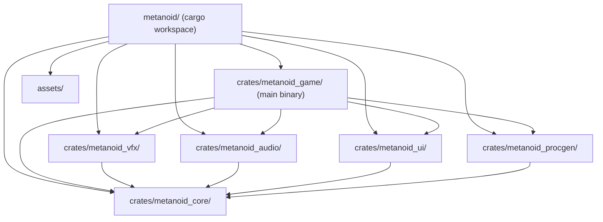
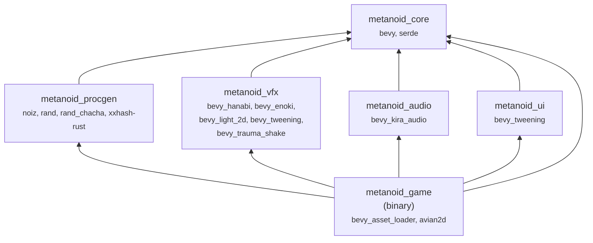

# Metanoid — Full Architecture & Development Plan

---

## Workspace Structure



---

## Crate Breakdown

### `metanoid_core`

The shared foundation. Every other crate depends on this. It owns zero logic — only shared types, constants, events, and component definitions.

```
metanoid_core/
├── src/
│   ├── lib.rs
│   ├── components/
│   │   ├── ball.rs          # Ball, BallEffect, BallTrail
│   │   ├── brick.rs         # Brick, BrickType, BrickHealth, BrickBehavior
│   │   ├── paddle.rs        # Paddle, PaddleSize, PaddleAbility
│   │   ├── powerup.rs       # PowerUp, PowerUpKind, ActiveEffects
│   │   ├── projectile.rs    # Laser, Lightning
│   │   └── wall.rs          # Wall, Boundary
│   ├── events/
│   │   ├── collision.rs     # BrickHitEvent, WallHitEvent, PaddleHitEvent
│   │   ├── gameplay.rs      # BrickDestroyedEvent, PowerUpCollectedEvent,
│   │   │                    # ComboEvent, LevelClearedEvent, LifeLostEvent
│   │   ├── vfx.rs           # SpawnParticleEvent, ShakeEvent, FlashEvent
│   │   └── audio.rs         # PlaySfxEvent, MusicTransitionEvent
│   ├── resources/
│   │   ├── game_state.rs    # Score, Lives, ComboCounter, ActivePowerUps
│   │   ├── level_data.rs    # LevelDefinition, BiomeDefinition, BrickGrid
│   │   └── settings.rs      # GameSettings, AudioSettings, VideoSettings
│   ├── states.rs            # AppState enum (Loading, Menu, Playing, Paused, 
│   │                        #   LevelComplete, GameOver, LevelSelect)
│   └── constants.rs         # GRID_COLS, GRID_ROWS, BALL_RADIUS, BASE_SPEED,
│                            # MAX_BALLS, COMBO_DECAY_TIME, etc.
```

**Dependencies:** `bevy`, `serde`

---

### `metanoid_procgen`

The procedural universe engine. Completely independent of rendering — it outputs pure data structures. This means it's testable without a GPU, and the AI agent can write and verify it with unit tests alone.

```
metanoid_procgen/
├── src/
│   ├── lib.rs
│   ├── seed/
│   │   ├── hierarchy.rs      # MasterSeed → Galaxy → Biome → Level sub-seed derivation
│   │   └── hasher.rs         # xxh3-based deterministic sub-seed generation
│   ├── universe/
│   │   ├── galaxy.rs         # GalaxyGenerator — derives biome count, order, difficulty base
│   │   └── progression.rs    # Infinite galaxy sequencing, difficulty scaling curve
│   ├── biome/
│   │   ├── parameters.rs     # BiomeParams: temperature, density, chaos, energy, weirdness
│   │   ├── generator.rs      # BiomeGenerator — maps seed → BiomeParams via attractor system
│   │   ├── palette.rs        # ProceduralPalette — HSL-based color harmony generation
│   │   ├── theme.rs          # BiomeTheme — particle styles, bloom intensity, background layers
│   │   └── hazards.rs        # BiomeHazards — unique mechanics per biome
│   ├── level/
│   │   ├── layout/
│   │   │   ├── geometric.rs  # Symmetric, concentric, grid, diagonal, tessellation patterns
│   │   │   ├── hybrid.rs     # Wave functions, Voronoi regions, fractal subdivision, L-systems
│   │   │   ├── organic.rs    # Simplex threshold, cellular automata, DLA
│   │   │   └── selector.rs   # Pattern selection based on chaos axis + weighted random
│   │   ├── layers/
│   │   │   ├── base.rs       # Layer 1: binary brick/no-brick matrix
│   │   │   ├── brick_type.rs # Layer 2: assign BrickType using clustered noise
│   │   │   ├── health.rs     # Layer 3: HP distribution with top-heavy gradient + noise
│   │   │   ├── specials.rs   # Layer 4: strategic placement of moving/teleport/explosive
│   │   │   ├── powerups.rs   # Layer 5: power-up seeding with pity timer
│   │   │   └── carving.rs    # Layer 6: negative space — ensure ball pathways exist
│   │   ├── validator.rs      # Layer 7: solvability check, unreachable brick detection, auto-fix
│   │   ├── boss.rs           # Boss level generator — extremified biome params
│   │   └── composer.rs       # Orchestrates all 7 layers into final LevelDefinition
│   ├── difficulty/
│   │   ├── curve.rs          # Per-biome difficulty curve (intro → ramp → boss)
│   │   └── adaptive.rs       # Adaptive modifiers based on player performance metrics
│   └── sharing.rs            # Seed encoding/decoding to shareable base62 strings
```

**Dependencies:** `metanoid_core`, `noiz`, `rand`, `rand_chacha`, `xxhash-rust`, `serde`

---

### `metanoid_vfx`

All visual effects, particles, lighting, post-processing configuration, and screen-space effects. Reads events from core, spawns visual entities.

```
metanoid_vfx/
├── src/
│   ├── lib.rs                 # VfxPlugin — registers all sub-plugins
│   ├── particles/
│   │   ├── brick_break.rs     # Hanabi burst effect per brick color/type
│   │   ├── ball_trail.rs      # Persistent trail behind each ball
│   │   ├── fireball.rs        # Flame particles around fireball
│   │   ├── explosion.rs       # Large explosion for explosive bricks
│   │   ├── powerup_aura.rs    # Glow particles around falling power-ups
│   │   ├── ambient.rs         # Background atmosphere particles per biome
│   │   ├── combo_burst.rs     # Escalating particles on combo milestones
│   │   └── shield.rs          # Shield shimmer effect
│   ├── lighting/
│   │   ├── ball_light.rs      # Dynamic point light following each ball
│   │   ├── brick_glow.rs      # Pulsing emission on special bricks
│   │   ├── paddle_light.rs    # Light under paddle
│   │   └── biome_ambient.rs   # Per-biome ambient lighting configuration
│   ├── post_processing/
│   │   ├── camera_setup.rs    # HDR camera + bloom + chromatic aberration + vignette
│   │   ├── combo_effects.rs   # Increase bloom/aberration on high combos
│   │   └── transition.rs      # Level transition visual effects (fade, wipe, dissolve)
│   ├── tweens/
│   │   ├── brick_enter.rs     # Bricks animate in at level start
│   │   ├── brick_hit.rs       # Flash/shake on brick hit
│   │   ├── powerup_float.rs   # Oscillating float for falling power-ups
│   │   ├── paddle_resize.rs   # Smooth paddle size change
│   │   └── score_popup.rs     # Floating score numbers that fade up
│   ├── shake.rs               # Trauma-based screen shake triggers
│   └── background/
│       ├── parallax.rs        # Multi-layer parallax background system
│       └── generator.rs       # Procedural background from biome theme
```

**Dependencies:** `metanoid_core`, `bevy`, `bevy_hanabi`, `bevy_enoki`, `bevy_light_2d`, `bevy_tweening`, `bevy_trauma_shake`

---

### `metanoid_audio`

All audio logic. Reacts to gameplay events, manages channels, handles adaptive music.

```
metanoid_audio/
├── src/
│   ├── lib.rs              # AudioPlugin
│   ├── channels.rs         # Define audio channels: Music, Sfx, UiSfx, Ambient
│   ├── sfx/
│   │   ├── brick.rs        # Hit/destroy sounds per brick type, pitch scaling on combo
│   │   ├── ball.rs         # Bounce sounds, whoosh for fast ball
│   │   ├── paddle.rs       # Paddle hit, catch, resize sounds
│   │   ├── powerup.rs      # Collect sound, activate sound, negative power-up warning
│   │   └── ui.rs           # Menu navigation, button clicks
│   ├── music/
│   │   ├── manager.rs      # Track selection based on biome mood vector
│   │   ├── adaptive.rs     # Layer/filter changes based on gameplay intensity
│   │   └── transition.rs   # Crossfade between tracks on biome change
│   └── spatial.rs          # Panning based on ball/event X position
```

**Dependencies:** `metanoid_core`, `bevy`, `bevy_kira_audio`

---

### `metanoid_ui`

All UI: menus, HUD, overlays. Uses Bevy 0.19 built-in Feathers widgets + BSN.

```
metanoid_ui/
├── src/
│   ├── lib.rs              # UiPlugin
│   ├── hud/
│   │   ├── score.rs        # Score display + combo multiplier indicator
│   │   ├── lives.rs        # Life counter with animated hearts
│   │   ├── powerup_bar.rs  # Active power-up timers display
│   │   ├── level_info.rs   # Galaxy/Biome/Level indicator
│   │   └── minimap.rs      # Small brick grid overview
│   ├── menus/
│   │   ├── main_menu.rs    # Title screen, play, settings, quit
│   │   ├── pause.rs        # Pause overlay with blur background
│   │   ├── settings.rs     # Audio, video, controls settings
│   │   ├── level_select.rs # Galaxy map / biome browser
│   │   ├── game_over.rs    # Final score, stats, share seed button
│   │   └── level_clear.rs  # Stats summary, next level, replay
│   └── shared/
│       ├── widgets.rs      # Reusable styled buttons, panels, etc.
│       └── transitions.rs  # UI screen transition animations
```

**Dependencies:** `metanoid_core`, `bevy`, `bevy_tweening`

---

### `metanoid_game`

The main binary. Orchestrates everything. Contains the actual gameplay systems.

```
metanoid_game/
├── src/
│   ├── main.rs                 # App::new(), plugin registration
│   ├── plugins.rs              # Registers all crate plugins in correct order
│   ├── systems/
│   │   ├── input.rs            # Keyboard/mouse/gamepad → paddle movement
│   │   ├── ball_physics.rs     # Ball launch, speed clamping, stuck detection
│   │   ├── collision/
│   │   │   ├── brick.rs        # Ball↔Brick collision response, damage, destroy
│   │   │   ├── paddle.rs       # Ball↔Paddle — angle based on hit position
│   │   │   ├── wall.rs         # Ball↔Wall bouncing
│   │   │   └── powerup.rs      # PowerUp↔Paddle collection
│   │   ├── powerup/
│   │   │   ├── spawner.rs      # Spawn power-up entity when brick destroyed
│   │   │   ├── collector.rs    # Apply power-up effect on collection
│   │   │   ├── effects.rs      # Each power-up effect implementation
│   │   │   └── timer.rs        # Timed power-up expiry
│   │   ├── brick/
│   │   │   ├── moving.rs       # Moving brick oscillation
│   │   │   ├── regen.rs        # Regenerating brick heal timer
│   │   │   ├── explosive.rs    # Chain explosion propagation
│   │   │   ├── teleport.rs     # Teleport brick ball redirection
│   │   │   ├── gravity.rs      # Gravity brick force field
│   │   │   └── chain.rs        # Chain brick electricity propagation
│   │   ├── combo.rs            # Combo counter, multiplier, decay timer
│   │   ├── scoring.rs          # Point calculation, multipliers
│   │   ├── level_lifecycle.rs  # Level load, clear check, transition to next
│   │   ├── difficulty.rs       # Runtime adaptive difficulty adjustments
│   │   └── bullet_time.rs      # Slow-motion activation and visual effects
│   ├── setup/
│   │   ├── camera.rs           # Camera spawn with post-processing stack
│   │   ├── arena.rs            # Walls, boundaries, paddle spawn
│   │   └── level_spawner.rs    # Takes LevelDefinition → spawns all entities
│   └── debug/
│       ├── inspector.rs        # Dev-only: bevy_inspector_egui for live ECS inspection
│       └── procgen_preview.rs  # Dev-only: preview levels by seed without playing
```

**Dependencies:** all crates + `bevy_asset_loader`

---

## Dependency Graph



---

## Development Plan

### Category A: Foundation

**A1 — Workspace scaffolding**
Set up the cargo workspace with all 6 crates, configure `Cargo.toml` at root and per-crate, add all dependencies, verify everything compiles. Create the `AppState` enum and state transition skeleton. Set up the dev profile with optimized deps.

**Deliverable:** `cargo build` succeeds, app window opens with a colored background and state transitions between Loading → Menu → Playing (empty screens).

**A2 — Arena and basic physics**
Spawn the camera (2D, HDR enabled), four walls as static rigid bodies, a paddle as a kinematic rigid body, and a single ball as a dynamic rigid body. Implement paddle movement from keyboard/mouse input. Implement ball launch on spacebar. Configure Avian2D collision groups (ball↔wall, ball↔paddle). Ball bounces off walls and paddle with correct angles.

**Deliverable:** A playable pong-like screen — ball bounces around, paddle moves, ball reflects off walls and paddle. No bricks yet.

**A3 — Brick system foundation**
Define the `Brick` component with `BrickType` and `BrickHealth`. Create a temporary hardcoded grid of basic bricks (static rigid bodies with rectangle colliders). Handle ball↔brick collision events: decrement health, destroy brick entity at 0 HP. Emit `BrickDestroyedEvent`. Detect level clear (all destroyable bricks gone).

**Deliverable:** A fully playable basic breakout. Ball breaks bricks, bricks disappear, level clears when all bricks are gone. Plain colored rectangles, no effects.

---

### Category B: Procedural Engine

**B1 — Seed hierarchy and hashing**
Implement `MasterSeed`, the xxh3-based sub-seed derivation chain (Master → Galaxy → Biome → Level → Layer sub-seeds). Implement `ChaCha8Rng` seeding from derived seeds. Implement base62 encoding/decoding for shareable seed strings. Write exhaustive unit tests proving determinism across runs.

**Deliverable:** Unit tests that generate 1000 seed hierarchies and verify identical output every time. Shareable seed strings encode/decode correctly.

**B2 — Biome parameter generation**
Implement the 5-axis biome parameter space (temperature, density, chaos, energy, weirdness). Implement the attractor system that biases random biome parameters toward coherent archetypes. Implement `ProceduralPalette` — HSL color harmony generation (analogous, complementary, triadic) driven by biome parameters. Implement `BiomeTheme` struct that packages palette, particle style hints, bloom intensity, background config.

**Deliverable:** A CLI test binary that takes a master seed, prints all galaxies/biomes for the first 5 galaxies with their parameters and color palettes. Visual verification by outputting palette swatches as a simple Bevy scene (colored rectangles).

**B3 — Layout pattern generators**
Implement all pattern generators: geometric (symmetric mirror, concentric, grid-with-cutouts, diagonal, tessellation), hybrid (wave functions, Voronoi, fractal subdivision, L-systems), organic (Simplex threshold, cellular automata, DLA). Each generator takes a seed + biome parameters and outputs a `BrickGrid` (2D bool matrix). Implement the pattern selector that picks a generator based on chaos axis.

**Deliverable:** A preview tool that renders 20 random layouts as simple colored grids in a Bevy window. Navigate with arrow keys to browse seeds. Visually verify pattern variety and quality.

**B4 — Layer composition pipeline**
Implement all 7 layers as a pipeline: base structure → brick type assignment (clustered noise) → health distribution (gradient + noise) → special placement (strategic positioning) → power-up seeding (with pity timer) → negative space carving (ensure ball pathways) → validation (solvability check + auto-fix). Each layer uses its own sub-seed.

**Deliverable:** The preview tool now shows fully composed levels with brick types represented as different colors, health as opacity, specials marked with symbols. Navigate 100+ levels and verify none look broken or unsolvable.

**B5 — Galaxy progression and difficulty**
Implement galaxy sequencing (infinite galaxies, each with 3-6 biomes, each biome with 10-15 levels). Implement the per-biome difficulty curve (intro → ramp → boss). Implement boss level generation (extremified parameters). Implement adaptive difficulty modifier (separate from seed-based layout).

**Deliverable:** The preview tool can now display an entire galaxy worth of levels in sequence. Difficulty visually ramps (denser, more specials, more health). Boss levels are clearly more intense. Print difficulty stats per level.

**B6 — Integration with game**
Connect procgen output to the level spawner in `metanoid_game`. When transitioning to a new level, generate `LevelDefinition` from current galaxy/biome/level index, spawn all brick entities with correct types, health, colliders, positions. Wire level progression: clear → generate next → spawn.

**Deliverable:** The game is now infinitely playable with procedural levels. No visual effects yet, but every level is unique and gameplay works end-to-end.

---

### Category C: Power-Up System

**C1 — Power-up spawning and collection**
When a brick is destroyed, roll for power-up drop based on seeded probabilities. Spawn a power-up entity that falls with gravity. Detect paddle↔power-up collision. Emit `PowerUpCollectedEvent`. Implement pity timer (guaranteed drop after N bricks without one).

**Deliverable:** Power-ups drop from destroyed bricks, fall down, and get collected by paddle. Temporary placeholder visuals (colored circles with letters).

**C2 — Ball modifier power-ups**
Implement: Fireball (passes through bricks, destroys on contact), Brick-Thru (same but no explosion), Mega Ball (larger radius + collider), Shrink Ball (smaller + bonus points), Split Ball (duplicate ball entity), Eight Balls (spawn 7 extra), Fast Ball, Slow Ball, Magnet Ball (attracted toward nearest brick), Phantom Ball (periodic visibility toggle). Each is an ECS component added to ball entities with a timer.

**Deliverable:** All ball modifiers functional and testable in gameplay.

**C3 — Paddle modifier power-ups**
Implement: Laser Paddle (fire projectile entities upward), Grab Paddle (ball sticks on contact, re-launch on click), Expand/Shrink Paddle (resize with smooth tween), Shield (temporary floor barrier entity), Mirror Paddle (second paddle entity mirrored at top or ghost).

**Deliverable:** All paddle modifiers functional.

**C4 — Board modifier power-ups**
Implement: Falling Bricks (all bricks shift down one row), Zap (remove all invincible armor), Explode (trigger all explosive bricks), Expand Exploding (convert random bricks to explosive), Lightning (random brick strikes), Shockwave (radial force from paddle), Shuffle (randomize brick positions preserving types).

**Deliverable:** All board modifiers functional.

**C5 — General power-ups and combo system**
Implement: Extra Life, Level Warp, Double Points (timed), Kill Paddle (lose life), Time Slow (bullet time — scale physics timestep), Random Power (weighted random from all others). Implement combo system: consecutive hits increment combo counter, combo decays after timeout, multiplier affects score, combo milestones trigger events.

**Deliverable:** Full power-up system operational. Combo counter visible (placeholder HUD text). Bullet time visually slows gameplay.

---

### Category D: Visual Effects

**D1 — Post-processing pipeline**
Configure camera with HDR + Bloom (intensity driven by biome energy parameter) + ChromaticAberration (driven by combo) + Vignette (increases during danger) + LensDistortion (pulse on explosions). All parameters animate smoothly via systems that read game state.

**Deliverable:** The game looks dramatically different already — glowing bricks, light blooming off the ball, cinematic feel.

**D2 — Particle effects (Hanabi)**
Implement all Hanabi-based GPU particle effects: brick break burst (color-matched, count scales with brick type), ball trail (persistent emitter following ball), fireball flames, large explosion, combo milestone burst. Each effect reads biome theme for color tuning.

**Deliverable:** Destroying bricks creates satisfying particle explosions. Ball leaves a glowing trail. The game feels "juicy."

**D3 — Particle effects (Enoki) + custom shaders**
Implement Enoki-based effects that need custom fragment shaders: power-up aura with chromatic shimmer, shield distortion effect, dissolve effect when bricks fade. Set up `.ron` effect definitions with hot-reload for iteration.

**Deliverable:** Power-ups glow with unique auras, shield has a visible energy barrier, special bricks have distinct idle animations.

**D4 — 2D Lighting**
Add `bevy_light_2d` setup. Ball emits colored point light. Explosive bricks pulse red light. Power-ups glow. Paddle has a subtle light underneath. Biome ambient light configurable. Dark biome variant where the ball is the primary light source.

**Deliverable:** The game has depth and atmosphere. Dark biomes feel tense. Neon biomes feel vibrant.

**D5 — Tweens and screen shake**
Implement all tween animations: bricks enter scene (scale bounce), brick hit flash (color tween), paddle resize (smooth scale), power-up float (sine oscillation), score popup (translate up + fade out). Implement trauma-based screen shake for hits, explosions, combo milestones with biome-tuned intensities.

**Deliverable:** Every interaction feels responsive. The screen reacts to gameplay. Nothing feels static.

**D6 — Parallax background and biome visuals**
Implement multi-layer parallax background system. Layers generated from biome theme: deep gradient, slow geometric shapes, medium floating elements, foreground atmospheric particles. Background reacts subtly to paddle position (parallax shift).

**Deliverable:** Each biome has a visually distinct background. The world feels alive behind the gameplay.

---

### Category E: Audio

**E1 — Audio foundation**
Set up Kira audio channels (Music, Sfx, UiSfx, Ambient). Implement spatial panning (events emit from X position → stereo pan). Implement basic SFX: ball bounce (wall, paddle, brick with different sounds), brick destroy, power-up collect, life lost.

**Deliverable:** The game has sound. Every interaction produces audio feedback.

**E2 — Combo audio and dynamic SFX**
Implement pitch scaling on combo (consecutive hits raise pitch incrementally). Implement per-brick-type sounds (metal, glass, wood, explosion). Implement power-up activation sounds, negative power-up warning sound, bullet time audio slowdown effect.

**Deliverable:** Audio dynamically responds to gameplay state. Combos sound increasingly intense.

**E3 — Adaptive music**
Implement biome mood vector → track selection. Implement layer-based adaptive music (calm layers during normal play, intense layers added when combo is high or few bricks remain). Implement crossfade between tracks on biome transitions.

**Deliverable:** Music feels connected to gameplay. Biome transitions feel smooth. Intense moments have matching audio intensity.

---

### Category F: UI

**F1 — HUD**
Implement score display (with combo multiplier shown), life counter (animated), active power-up timers (icons with countdown bars), current galaxy/biome/level indicator. All using Bevy Feathers widgets + BSN.

**Deliverable:** Player has full information during gameplay. HUD is clean and unobtrusive.

**F2 — Menus**
Implement main menu (title, play, settings, quit), pause overlay (with Gaussian blur background), settings screen (audio volume sliders, visual quality toggles, controls), game over screen (final score, stats, share seed button), level complete screen (stats summary, next level).

**Deliverable:** Full menu flow. Player can navigate, change settings, pause/resume.

**F3 — Galaxy map / Level select**
Implement a visual galaxy/biome browser. Show biome palettes as previews. Allow jumping to any previously reached level. Display seed string for sharing.

**Deliverable:** Player can browse the universe, revisit levels, share seeds.

---

### Category G: Polish & Ship

**G1 — Special brick behaviors**
Implement all advanced brick types that need dedicated systems: Moving bricks (oscillation patterns), Regenerating bricks (heal timer + visual feedback), Gravity bricks (force field on nearby balls), Teleport bricks (paired portals), Chain bricks (electricity propagation on hit), Color-Match bricks (only destroyed by matching ball color).

**Deliverable:** All brick types playable and integrated with VFX/audio.

**G2 — Persistence**
Save/load using Bevy App Settings: highscores per galaxy, furthest reached level, player settings, unlocked achievements. Save combo statistics and player performance metrics for adaptive difficulty.

**Deliverable:** Player progress persists between sessions.

**G3 — Performance profiling and optimization**
Profile with Tracy/Bevy diagnostics. Optimize particle counts per biome. Ensure stable 60fps on mid-range hardware. Optimize procgen to complete within 1 frame. Pool and reuse entities where possible.

**Deliverable:** Solid 60fps+ on target hardware, no frame drops on level transitions.

**G4 — WASM build**
Configure WASM target, verify Avian2D + Hanabi work in browser, handle audio autoplay restrictions, configure asset loading for web. Test cross-browser.

**Deliverable:** Playable in a web browser at near-native performance.

---

## Development Sequence (Dependency Order)

```mermaid
gantt
    dateFormat X
    axisFormat %s
    
    section Foundation
    A1 Workspace Setup           :a1, 0, 1
    A2 Arena + Physics           :a2, after a1, 2
    A3 Brick System              :a3, after a2, 2

    section Procgen
    B1 Seed Hierarchy            :b1, after a1, 1
    B2 Biome Parameters          :b2, after b1, 2
    B3 Layout Generators         :b3, after b2, 3
    B4 Layer Composition         :b4, after b3, 3
    B5 Galaxy + Difficulty       :b5, after b4, 2
    B6 Integration               :b6, after b5, 1
    
    section Power-Ups
    C1 Spawning + Collection     :c1, after a3, 1
    C2 Ball Modifiers            :c2, after c1, 2
    C3 Paddle Modifiers          :c3, after c2, 2
    C4 Board Modifiers           :c4, after c3, 2
    C5 Combo System              :c5, after c4, 1

    section VFX
    D1 Post-Processing           :d1, after a3, 1
    D2 Hanabi Particles          :d2, after d1, 3
    D3 Enoki + Shaders           :d3, after d2, 2
    D4 2D Lighting               :d4, after d3, 2
    D5 Tweens + Shake            :d5, after d1, 2
    D6 Backgrounds               :d6, after d4, 2

    section Audio
    E1 Audio Foundation          :e1, after a3, 1
    E2 Dynamic SFX               :e2, after e1, 2
    E3 Adaptive Music            :e3, after e2, 2

    section UI
    F1 HUD                       :f1, after a3, 1
    F2 Menus                     :f2, after f1, 2
    F3 Galaxy Map                :f3, after f2, 2

    section Polish
    G1 Special Bricks            :g1, after c5, 3
    G2 Persistence               :g2, after f2, 1
    G3 Performance               :g3, after g1, 2
    G4 WASM                      :g4, after g3, 1
```



---

## Assets Checklist

Everything the game needs that isn't code.

### Sprites & Textures

| Asset | Description | Format |
|---|---|---|
| `brick_atlas.png` | Spritesheet with all brick types (normal, multi-hit stages, invincible, explosive, moving, regen, gravity, teleport, chain, color-match) — at least 12 variants × 4 states | PNG atlas |
| `paddle_default.png` | Default paddle sprite | PNG |
| `paddle_laser.png` | Paddle with laser cannons variant | PNG |
| `paddle_magnet.png` | Paddle with magnet glow variant | PNG |
| `ball_default.png` | Default ball sprite (small, clean, glows with bloom) | PNG |
| `ball_fireball.png` | Fireball variant | PNG |
| `ball_phantom.png` | Phantom ball (semi-transparent) | PNG |
| `powerup_icons.png` | Spritesheet of all power-up icons (~25 icons) | PNG atlas |
| `shield.png` | Shield barrier sprite (tileable horizontally) | PNG |
| `laser_bolt.png` | Laser projectile sprite | PNG |
| `lightning_bolt.png` | Lightning strike sprite | PNG |
| `heart.png` | Life indicator heart | PNG |
| `background_elements.png` | Reusable geometric shapes for parallax layers (circles, hexagons, lines, dots) | PNG atlas |

### Particle Textures

| Asset | Description |
|---|---|
| `particle_circle_soft.png` | Soft circle gradient for general particles |
| `particle_spark.png` | Small bright spark |
| `particle_flame.png` | Teardrop flame shape |
| `particle_shard.png` | Angular brick shard |
| `particle_ring.png` | Ring/donut for shockwave |
| `particle_star.png` | Star shape for combo celebrations |

### Audio — SFX

| Asset | Description | Format |
|---|---|---|
| `sfx_bounce_wall.ogg` | Ball hits wall | OGG |
| `sfx_bounce_paddle.ogg` | Ball hits paddle (with slight variation per hit position) | OGG |
| `sfx_brick_normal.ogg` | Normal brick hit | OGG |
| `sfx_brick_metal.ogg` | Invincible/metal brick hit | OGG |
| `sfx_brick_glass.ogg` | Glass brick destroy | OGG |
| `sfx_brick_explode.ogg` | Explosive brick detonation | OGG |
| `sfx_brick_regen.ogg` | Regenerating brick heal sound | OGG |
| `sfx_powerup_drop.ogg` | Power-up starts falling | OGG |
| `sfx_powerup_collect.ogg` | Power-up collected (positive) | OGG |
| `sfx_powerup_negative.ogg` | Negative power-up warning | OGG |
| `sfx_laser_fire.ogg` | Laser shot | OGG |
| `sfx_lightning.ogg` | Lightning strike | OGG |
| `sfx_shield_activate.ogg` | Shield appears | OGG |
| `sfx_shield_hit.ogg` | Ball bounces off shield | OGG |
| `sfx_life_lost.ogg` | Ball falls past paddle | OGG |
| `sfx_level_clear.ogg` | Level completed fanfare | OGG |
| `sfx_combo_milestone.ogg` | Combo reaches milestone (x5, x10, x20...) | OGG |
| `sfx_bullet_time_enter.ogg` | Slow-motion activation | OGG |
| `sfx_bullet_time_exit.ogg` | Slow-motion deactivation | OGG |
| `sfx_teleport.ogg` | Teleport brick warps ball | OGG |
| `sfx_chain_electricity.ogg` | Chain brick propagation | OGG |
| `sfx_menu_hover.ogg` | Menu button hover | OGG |
| `sfx_menu_select.ogg` | Menu button select | OGG |

### Audio — Music

| Asset | Description |
|---|---|
| `music_menu.ogg` | Main menu theme — atmospheric, inviting |
| `music_neon.ogg` | Neon/Cyberpunk biome — synthwave, layered stems |
| `music_ocean.ogg` | Deep Ocean biome — ambient, flowing |
| `music_volcanic.ogg` | Volcanic biome — aggressive, percussive |
| `music_crystal.ogg` | Crystal/Ice biome — ethereal, bell-like |
| `music_space.ogg` | Space biome — vast, cosmic |
| `music_boss.ogg` | Boss level overlay — intensifier layer |

> Ideally each music track is authored with separable stems (bass, melody, percussion, atmosphere) so the adaptive music system can layer them based on gameplay intensity.

### Fonts

| Asset | Description |
|---|---|
| `font_main.ttf` | Primary UI font — clean, modern, variable weight (Bevy 0.19 supports variable weight fonts) |
| `font_score.ttf` | Score/numbers font — bold, impactful |
| `font_title.ttf` | Title screen font — stylized, neon-aesthetic |

### Shader Files (for Enoki custom effects)

| Asset | Description |
|---|---|
| `shaders/powerup_aura.wgsl` | Chromatic shimmer shader for power-up particles |
| `shaders/shield_barrier.wgsl` | Energy distortion shader for shield effect |
| `shaders/dissolve.wgsl` | Brick dissolve effect shader |
| `shaders/portal.wgsl` | Teleport brick portal effect |

### Enoki Particle Definitions

| Asset | Description |
|---|---|
| `particles/brick_break.ron` | Brick destruction burst config |
| `particles/ball_trail.ron` | Ball trail emitter config |
| `particles/fireball.ron` | Fireball effect config |
| `particles/explosion.ron` | Large explosion config |
| `particles/powerup_glow.ron` | Power-up aura config |
| `particles/ambient_neon.ron` | Neon biome background particles |
| `particles/ambient_ocean.ron` | Ocean biome background particles |
| `particles/ambient_volcanic.ron` | Volcanic biome background particles |
| `particles/combo_burst.ron` | Combo milestone celebration |

---

## Assets Directory Structure

```
assets/
├── sprites/
│   ├── brick_atlas.png
│   ├── paddle_default.png
│   ├── paddle_laser.png
│   ├── paddle_magnet.png
│   ├── ball_default.png
│   ├── ball_fireball.png
│   ├── ball_phantom.png
│   ├── powerup_icons.png
│   ├── shield.png
│   ├── laser_bolt.png
│   ├── lightning_bolt.png
│   ├── heart.png
│   └── background_elements.png
├── particles/
│   ├── textures/
│   │   ├── circle_soft.png
│   │   ├── spark.png
│   │   ├── flame.png
│   │   ├── shard.png
│   │   ├── ring.png
│   │   └── star.png
│   └── definitions/
│       ├── brick_break.ron
│       ├── ball_trail.ron
│       ├── fireball.ron
│       ├── explosion.ron
│       ├── powerup_glow.ron
│       ├── ambient_neon.ron
│       ├── ambient_ocean.ron
│       ├── ambient_volcanic.ron
│       └── combo_burst.ron
├── audio/
│   ├── sfx/
│   │   ├── bounce_wall.ogg
│   │   ├── bounce_paddle.ogg
│   │   ├── brick_normal.ogg
│   │   ├── brick_metal.ogg
│   │   ├── brick_glass.ogg
│   │   ├── brick_explode.ogg
│   │   ├── brick_regen.ogg
│   │   ├── powerup_drop.ogg
│   │   ├── powerup_collect.ogg
│   │   ├── powerup_negative.ogg
│   │   ├── laser_fire.ogg
│   │   ├── lightning.ogg
│   │   ├── shield_activate.ogg
│   │   ├── shield_hit.ogg
│   │   ├── life_lost.ogg
│   │   ├── level_clear.ogg
│   │   ├── combo_milestone.ogg
│   │   ├── bullet_time_enter.ogg
│   │   ├── bullet_time_exit.ogg
│   │   ├── teleport.ogg
│   │   ├── chain_electricity.ogg
│   │   ├── menu_hover.ogg
│   │   └── menu_select.ogg
│   └── music/
│       ├── menu.ogg
│       ├── neon.ogg
│       ├── ocean.ogg
│       ├── volcanic.ogg
│       ├── crystal.ogg
│       ├── space.ogg
│       └── boss.ogg
├── shaders/
│   ├── powerup_aura.wgsl
│   ├── shield_barrier.wgsl
│   ├── dissolve.wgsl
│   └── portal.wgsl
└── fonts/
    ├── main.ttf
    ├── score.ttf
    └── title.ttf
```

---

That's the complete architecture and development plan. Every step produces a visible, testable deliverable. The AI agent can work through categories in parallel where the dependency graph allows (for example, Category B and Category D1 can start simultaneously after A3). Ready to start building?